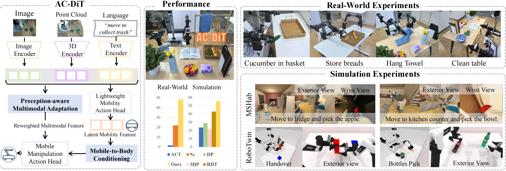

<div align="center">

# AC-DiT: Adaptive Coordination Diffusion Transformer for Mobile Manipulation


  
[🌐**Project Page**](https://ac-dit.github.io/) | [✍️**Paper**](??)

[Sixiang Chen](https://cscsx.github.io/)\*, [Jiaming Liu](https://liujiaming1996.github.io/)\*, [Siyuan Qian](https://siriyep.github.io/)\*, Han Jiang, [Xiaoqi Li](https://clorislili.github.io/clorisLi/), [Renrui Zhang](https://zrrskywalker.github.io/), [Zhuoyang Liu](https://zhuoyangliu2005.github.io/), [Chenyang Gu](https://gaystarc.github.io/), [Chengkai Hou](https://jackhck.github.io/), Pengwei Wang, Zhongyuan Wang, [Shanghang Zhang](https://www.shanghangzhang.com)

</div>



**AC-DiT** is a **end-to-end mobile manipulation framework** 🤖, which enhances the coordination between the mobile base and the manipulator by introducing two key mechanisms: mobile-to-body conditioning and perception-aware multimodal adaptation. 

## ✨ News ✨

- The code is coming in several weeks (before 2025/07/20)! 🔥
- [TBD] AC-DiT is now live on arXiv! 🚀 

## 📢 Coming Soon 📢

- **AC-DiT Model** 📦: Model details.

- **Simulation Experiments** 📈: Code for data collection, training, and evaluation on **ManiSkill-HAB** benchmark. 


## 📚 BibTeX 📚

```bibtex
to be defined
```
